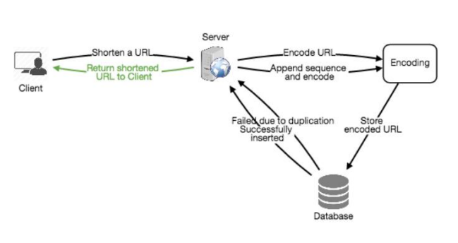
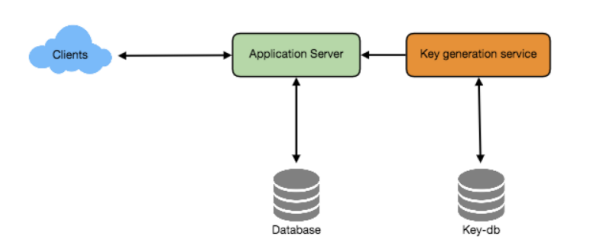
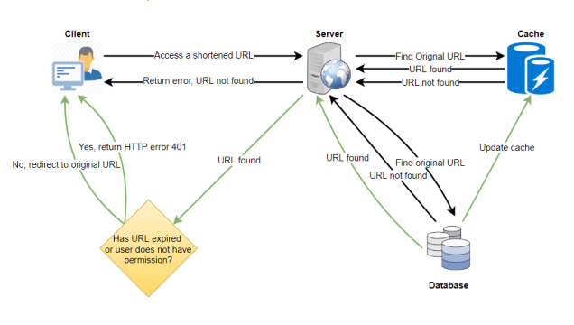
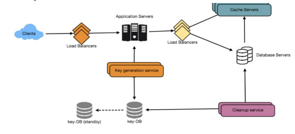

# TINY URL

## Why do we need it?

- Saves space while storing the URLs
- Hides original URL for privacy
- Easy to remember/less error-prone while using the shortened URLs


## REQUIREMENTS/GOALS

### Functional Requirements

- Given a URL, able to generate a shorter URL/alias
- Able to redirect to original URL using this alias
- User should have option to choose the short URL
- Ask for expiration date from the user

### Non Funtional Requirements

- High avaialability, so the redirection doesn't fail
- Min latency of redirection
- Aliases shouldn't be predictable

### Extended Requirements

- Redirection analytics (Count of redirection per tiny url)
- REST APIs (which can be used by others)


## CAPACITY ESTIMATIONS

This is a ready heavy service, lets assume **100:1 read-write ratio**

- **Traffic Estimates :** Let's say we get 500M new URLs per month. Thus the reads for this would be 50B
```
READS (PM) = 500M
WRITES (PM) = 500M * 100 = 50B

QPS (WRITE) = 500M/(30*24*60 *60)  = 200
QPS (READ) = QPS (WRITE) * 100 = 20K
```    

- **Storage Estimations :** Let's assume we will store the data for 5 years, and assumming each URL takes 500 bytes of space

```
URLS TO STORE = 500M * 12 * 5 = 30B
DATA TO STORE = 30B * 500 bytes = 15TB
```

- **Bandwidth Estimations**
```
WRITE = 200 URL/second * 500 bytes = 100 KB/s
READ = 20K URL/second * 500 bytes = 10 MB/s
``` 

- **Memory Estimations :** We would need to cache some hot URLs. Lets assume the 80-20 rule. (80% traffic comes from 20% URL).
Let's assume we want to refresh the cache daily
```
URLs read per day = 20K * 60 * 60 * 24 = 1.7B

(Need to cache 20% out of these)
Memory Required = 0.2 * 1.7B * 500 bytes = 170GB 
```
Note: There will be duplicate requests as well, so the actual usage will be less than 170GB always

- **High level Estimations**

|                      |            |
| -------------------- | ---------- |
| QPS (Write)          | 200        |
| QPS (Read)           | 20K        |
| Storage for 5 years  | 15TB       |
| Cache Memory         | 170GB      |
| Incoming Requests    | 100 KB/s   |
| Outgoing Requests    | 10 MB/s    |


## SYSTEM APIs

### CreateUrl
- Parameters
  - `dev_key`: Represents the registered account, can be used for limiting requests
  - `url`: Original URL that needs to be shortened
  - `expiration_date`: Optional
  - `custom_alias`: Optional 
  - `user_id`: Optional
- Returns: a new short URL or an error msg.

### DeleteUrl
- Parameters
    - `dev_key`
    - `url_key`: The short URL that needs to be deleted


## DATABASE DESIGN

### Key Observations

- Read heavy
- No relationship between the records (Other than the user who is creating)
- Need to store billion of records of small size


### TABLE URL
- HASH (PK) : VARCHAR(16)
- ORIGINAL_URL: VARCHAR(512)
- CREATED_ON : DATETIME
- EXPIRATION_DATE: DATETIME
- USER_ID: INT

### TABLE USER
- ID (PK) : INT
- NAME : VARCHAR(20)
- EMAIL: VARCHAR(32)
- CREATED_ON : DATETIME
- LAST_LOGIN : DATETIME

***Since we have billion of rows with no relationship, NoSQL (DynamoDB, Cassandra, etc) is a better choice***


## System Design and Algorithm
Main focus: Generating a unique key for every URL. Let's consider 2 approaches:

### 1. Encoding the original URL

- We can compute a unique hash (using MD5) and then encode it using Base64
- What should be the length of encoded keys?
    - Required rows to store : approx 30B
    - Using 6 letter keys would have `64^6 = 68.7B` combinations
    - Thus we can use **6 letter keys**
    - Each base64 character stores 6 bits of value
    - Thus, each key would have `6 * 6 = 36 bits` of value
- MD5 produces 128bit hash value
- Thus, we will have `128/6` = More than 21 characters per URL
- But we decided upon storing only 6 letter key, we have 21 letters now!
- What we can do is, only take the first 6 characters out of these 21
- This might result in duplicate keys, in this scenario, we can choose some other 6 characters out of the 21 or swap some characters.

#### ISSUES WITH THIS SOLUTION

- If multiple users enter same URL, it will return same result
- If parts of URL are URL-encoded, it might give inconsistent results

#### WORK-AROUNDS FOR THESE ISSUES

- We can append a sequence number for each URL and then encode
- But this number might overflow and this will hamper the performance
- Another solution is to append the user-id, but we will have to make it mandatory
- Add a unique key but that's another overhead.





### 2. Generating keys offline 

- We can have an independent key generating service (KGS)
- This will have a pre-generated set of random six letter strings stored in a DB (let's call it *KEY-DB*)
- It's easy and fast as we are not encoding anything, and no duplications here
- We will mark the key used if it is used in url generation
- But what if 2 or more sever try to use a key at the same time?
    - This might cause concurrency issues!
    - For this, we will have 2 different tables for *used-keys* and *unused-keys*
    - KGS will load some keys in memory of the server from the *unused-keys* and place them in *used-keys*
    - This will handle synchronisation so that it doesn't give the same key to different servers
- No issue if the memory dies before assigining the keys, since we have a lot of unique keys, we can afford to lose them
- Size of KEY-DB?
    - If we use base64, with 6 letter keys, we will have `64^6 = 68.7B` keys
    - Considering each character would use one byte, size would be `68.7B * 6 = 412GB`
- This is a single point of failure, for this we can have replicas
- For key-lookups, we can search our DB and return 302 redirect with the original URL, else raise a 404 error



## Data Partitioning and Replication

- As we have billions of rows, we need a partition scheme to scale the DB
- **Range based partitioning**:
    - We can partition on the basis of starting character of the hash key or the URL
    - URLs starting with character A in one partition, B in another, and so on.
    - We can store and retrieve in a predictable manner
    - But this can lead to unbalanced servers/partitions.
    - For example if there are too many URLs starting with E, this would unbalance the E server
- **Hash based partitioning**:
    - We take hash of the object and calculate the partition on the basis of that hash using our hashing function
    - The hashing function will randomly distribute the objects in different partitions
    - This still can lead to overloaded partitions which can be solved by consistent hashing


## Cache
- We can use off-the-shelf solutions like Memcache to store hot URLs
- The application servers, before hitting backend storage, can quickly check if the cache has the desired URL.
- As estimated above, we will need about 170GB memory which we may adjust on further analytics on the usage
- Since a modern day server has 256GB memory, we can fit this in one machine.
- We can use LRU for cache eviction.
- On a cache miss, request would go to backend, then we will also update our all the cache replicas by adding this new entry if not already there.



## Load Balancer
- Can add the following LBs:
    - B/W Client and Application server
    - B/W Application server and DB server
    - B/W Application server and cache server

- We can use round-robin approach
- This might overload an already loaded server, wer can re-adjust the policy then depending on the load upon the servers.


## Purging or DB cleanup
- We can do a lazy cleanup to reduce pressure on the DB
- Only expired links to be deleted
- Whenever user tries to access a expired link, we can delete that and raise 404
- We can have an independent scheduled cleaup service which will clean the data when the load is very low
- After removing, we can store the key in *unused-keys* table back




## Telemetry
- How many times a short URL has been used?
- User locations?
- Platform/browser used

## Security and Permissions
- Can users create private URLs?
- Can store public/private type in the URLs with the user-id
- If no permssion to access, raise 401