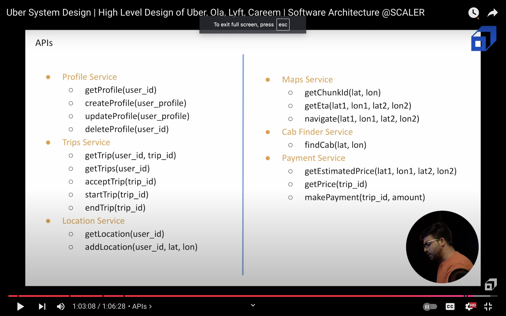
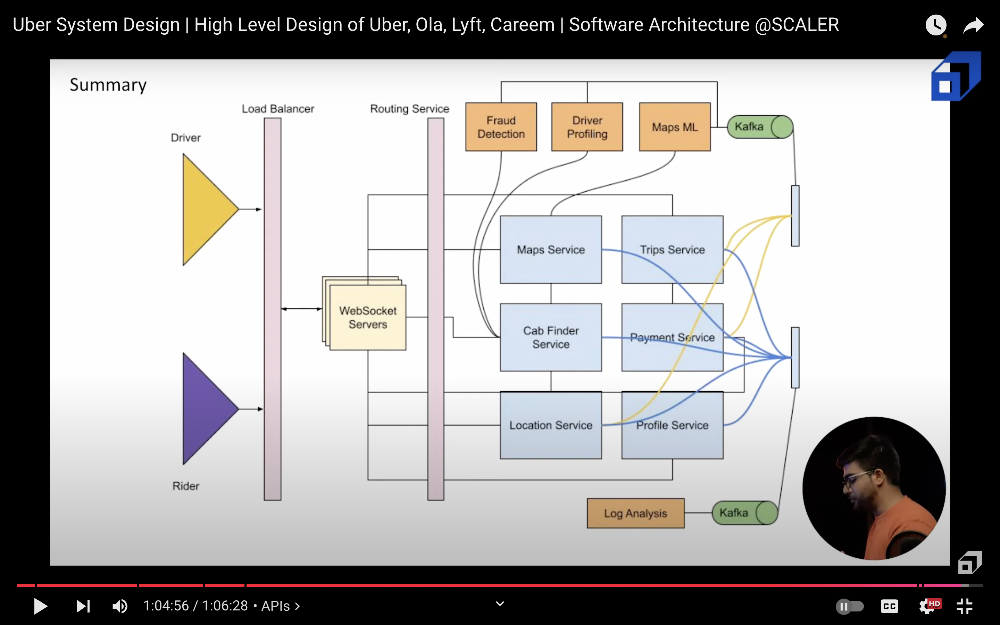

# UBER

## WHY DO WE NEED IT?
Cab booking service!

## REQUIREMENTS/GOALS

### Functional Requirements

- User End:
    - See nearby cabs
    - Check ETA and approx price
    - Book cab
    - Location tracking
- Driver End:
    - Show availability
    - Accept/reject rides
    - start/end rides
    - payments

### Non Funtional Requirements

- Global
- High avaialability
- Min latency

## CAPACITY ESTIMATIONS

- Assume 100M monthly active users
- Assume 10M daily rides -> 100 rides per second
- 1M drivers active per day

## STORAGE ESTIMATIONS
- For storing long, lat, user_id of all the drivers
    - we need 8+8+8 = 25 bytes
    - For 10M users, 25*1M (active drivers) = 25MB
    - We can store this small data in cache

- For entire location history of a user
    - Use nosql cluster like cassandra

## DESIGN

- Riders will have websocket connections open with server
- Using this they can keep on sending their location to server and server can notify about the ride to driver
- Store location as long and lat
    - For QPS of 100, if we search this table for drivers, it wont be efficient
    - We may create primary index on longitude but still inefficient
    - We can store long. in one table and lat. in one table and index them, but we would need to make joins
    - We need to convert this 2d data to 1d.
    - We will use geo hash (can also use quad trees)
    - uber actually uses google s2 library to find nearness (its similar to geo hashing)
    - based on a user location (in a chunk), our service will return the nearby chunks
    - we can ping the drivers in these chunks for a ride

- Cant rely on radial distance for ETA, since roads might have some route, we need to use google maps service
- pass the distance and time to pay service to calc the approx price

### Map Service
- responsible for storing this chunks data 

### Cab finder Service
- give chunk id -> return drivers
    - chunk 1 -> d1, d2, d4
    - chunk 2 -> d5, d6 

- Have multiple serviers storing some chunk
- Use consistent hashing 

### Location service
- Store entire location history of a user
- Store latest location of the driver

### Trip service
- Store trips
- 100 QPS
- Divide trips in 2 parts
- store inactive trips in no sql cluster
- store active trips in an sql
- To store 100 trips data:
    - 100 * 100 * 60 (assuming average trips lasts 100 minutes)
- Archiver moves active trips to inactive using a cron

### User service
- Store user data (crud)

### Payment service
- Expect payments

## API DESIGN

## DB DESIGN

## DETAILED DESIGN

