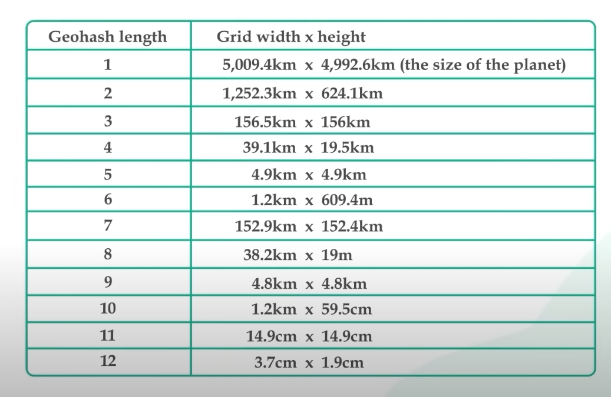

# Proximity Service

- Location based service
- Used to find something closest to a point
- Use cases :
    - Find closest gas station
    - Find closest restaurant

## Functional Req
- Given a location of users, return a list of closest businesses
- Add, update, remove businesses
- View detailed info of buss

## Non Functional Req
- Low latency
- High Avaialbility

## Back of the env Estimations
- Assume DAU = 100M
- Assume number of bizz = 200M
- Assume 5 queries per day per user
- QPS = 500M/10^5 = 5K QPS
- Storage estimations:
    - Will look when we see the things we need to store
    - Come back after tables
    - For bizz table
        - on avg, per bizz take 1KB per row (max 10kb per row)
        - 1KB * 200M = 200000MB = 200GB
    - For geospatial search
        - per row (3*8 bytes) = 24 bytes
        - 24 bytes * 200M = 4800MB = 5GB

## API
- Use Rest
- 1: get/v1/search/nearby
    - takes -> long, lat, radius
    - gives -> list of bizz
    - can use pagination
    - keep api small, will have separate detailed api

- 2: /v1/bizz:
    - CRUD

## Data Schema
- Bizz Table
    - bizz id
    - address, name, long, lat, etc
- Geospatial index
    - bizz id
    - location (long, lat)
    - requires geospatial search (will dig deeper later)

## Design Overview

- Location based service for searching nearby bizz
    - Read heavy
    - No writes at all
    - High QPS (5K)
- Bizz Service for Bizz CRUD
    - Not much writes
    - Reads might be high on busy days
    - Needs not to be highly consistent (eventually will do)
    - Should be highly available though

## Design Deep Dive
### DB Choice:

- Use geospatial DB
- They are optimised for storing and quering data in geometric space
- Eg: redis geo hash
- The most basic way to find nearby bizz would be a set of where clause on long and lat, etc which would be inefficient, esp on 200M entries
- We can optimise this by having index on longitude and latitude
- Lets say primary idx is latitude, it would still be inefficient bcs we need to find the intersection of given longitude and latitude
- Can we map this 2d data into 1d to make it efficient? 
- Yes! two approach:
    - Hash based: Even grid, geo hash, cartesian tiers
    - Tree based: Quad tree, google s2, Rtree
- They all divide the map into smaller areas and build indexes on it for fast search
- Hash based approach:
    - Divide the world into small grids
    - Each bizz belong to 1 specific grid 
    - Issue: uneven bizz distribution, a single hash can have a lot of bizz if in a concentrated area like times square
    - Ideally we would want to have big cells for NY for and small cell for a rural area
    - GEOHASHING is an improvement
        - Reduces 2d location data into 1d data of strings and digits 
        - Divide world into 4 quadrants (along prime meridian and equator)
        - These quadrants are represented by bits: 01 (EUR, APAC), 11(NA), 00(SA), 10(APAC, AFRICA)
        - Now each grid is further divided into 4 quadrants similarly
        - We keep on dividing these grids until a desired size is reached
        - Now a geohash for an area would be represented by some 01s, which is base32 encoded into a string of 6 letters (in google maps)
        - For our use case geohash length of 5 should be enough
        
    
- Tree based approach
 - Eg, Quadtree
 - Keep on dividing area into quadrants until a desired size is reached
 - in our use case we can keep on dividing until bizz in a quadrant is no more than some number (lets say 100)
 - this is in memory ds

### Applying geohashing in our design
- Our table will now look like this:
- Geospatial index
    - bizz id
    - geohash
- we can convert this geohash into long lat using any library
- To get the nearest bizz we can make a select query like:
    - SELECT bizz_id from geospatial_index where geohash like '9q8zn%'
    - We can get nearby 8 more cells to prevent edge cases where geohash is different for nearby locations
- Since our db size is low (5GBs) we really dont need sharding or other scaling solutions
- But our read QPS is high
    - We can use read replicas for this
    - We really dont need caching here

### Scaling bizz table
- It has records for 200M bizz
- 200GB size
- This is size is not too much for modern hardware
- Our DB is read heavy and updates are not that frequent
- We can add read replicas and caching layer here