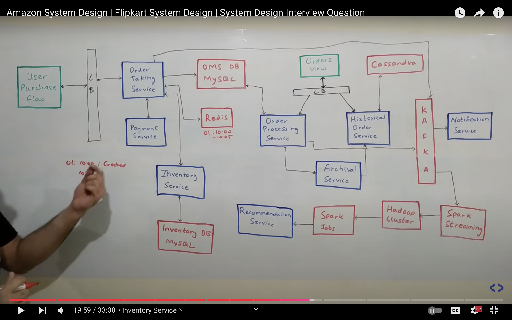
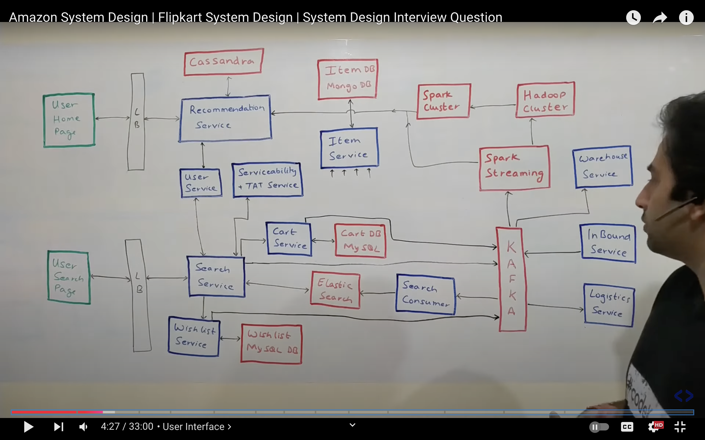

# E-Comm App like Flipkart/Amazon

## Functional Requirement
- Search for products
- See products details
- Add products to cart
- Place orders

## Non Functional Requirement
- 100ms of delay hurt conversion rate by 7%
- Make reads as fast as possible
- Writes too where are we able to
- Highly Consistent
- Available
- Low latency for search
- Failure protection
- Handle concurrency and heavy read and writes

## Capacity Estimations
- 1B active users
- 1B products
    - Lets say 1MB per product
    - 1B * 1MB = 1PB  (partition on products table)
- 10M orders per day -> 100 order per sec

## API Design
1. seach products
    - searchProducts(qs)
    - in reality theres a recomm. engine based on user history and surroundings, but lets keep it simple

2. Add to cart
    - addToCart(userId, productId, data)

3. Place order
    - placeOrder(userId, cartId)

## DB Design
- User Table
    - email
    - hash pass 
    - addr

- Cart
    - userId
    - productSet

- Products
    - Partion this as much as we want
    - Only 1 person will be editing a product
    - Single leader replication
    - NoSql
    - Id
    - Name
    - metadata

- Orders
    - Id
    - products
    - totalAmt
    - status

## Detailed Design

- Search
    - Possible to query db, but it would be slow
    - use search index (inverted index)
    - term -> mapping of products
    - shard by term in ideal world
    - or shard by doc ids (would need aggregation over multiple shards, not ideal)
    - can add cache to reduce latency
    - when vendors add products, use change data capture to place them in distributed search index

- Cart
    - Possible to edit card using two devices at a time
    - can use websockets, but it would have race conditions
    - can use version vectors
    - or, use multiple db leaders:
        - to make sure db agree with each other, use CRDT (conflict-free replicated datatype)
        - to handle multiple additions and deletions, use observe remove set

- Orders
    - Main part is to handle concurrency
    - can use locks -> it will make system slow
    - use write back cache
    - can use kafka queues to push orders 
    - confirm them once qty is matched
    - or cancel if out of stock

