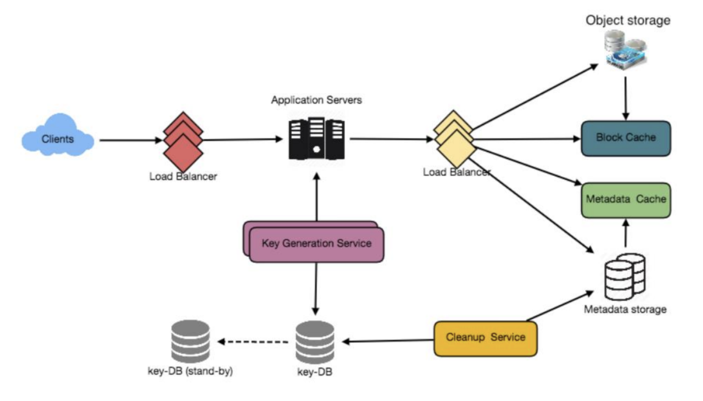

# Pastebin

## 1. WHY DO WE NEED IT?

- Enables users to store some temporary data and store it
- Can be used to share code-snippets


## 2. REQUIREMENTS/GOALS

### Functional Requirements

- Users should be able to upload or paste a data, generate a URL and share it
- Auto expiration of pastes, user should be able to enter a manual expiration time
- Feature to mark paste as public/private
- Users should be able to pick a custom alias for the unique generated url


### Non Functional Requirements

- High availability, if our service is down, users won't be able to access their pastes
- High reliability, any data uploaded should not be lost
- Users should be able to access their paste in real-time with min latency
- The links should not be predictable/guessable

### Extended Requirements

- Analytics (how many times a paste is being accessed)
- REST APIs which can be used by a 3rd party app

## 3. CAPACITY ESTIMATIONS

Our service would be read heavy
- Let's limit each data or paste to 10MB
- Let's assume, we will keep the data for 10 years
- Let's assume **1:5 write-read ratio**

### Traffic Estimations

- Assuming we get 1M pastes per day
```
WRITES (PM) = 30M
READS (PM) = 30*5 = 150M
WRITES FOR AN YEAR = 30M*12*10 = 3.6B

QPS (WRITE) = 30M/(30*24*60*60) = 12 pastes/sec
QPS (READ) = QPS (WRITE) * 5  = 60 pastes/sec
```

### Storage Estimations

- We are limiting the data to 10MB/paste but the data is usually very small. So it's safe to assume, each paste would be of 10KB on an average. As we have 1M pastes per day,

```
PASTES TO STORE = 1M * 10KB  = 10GB/day
PASTES TO STORE FOR 10 YEARS = 10GB*30*12*10 = 36TB
```

We would also need to store unique keys per paste. For 3.6B pastes, we can use 6 character base64 keys, which would give us `64^6 ~= 68.7B` unique keys

As 1 character takes 1 byte, for 3.6B 6 character keys, we would need `3.6B * 6 = 22GB`
This is negligible as compared to our `36TB` DB.

- We wouldn't want more than 70% of our DB to be filled, so taking some margin, our DB needs extend to roughly `51.4TB`


### Bandwidth Estimations

```
WRITE = 12 * 10KB/sec = 120KB/sec
READ = 60 * 10KB/sec = 600KB/sec
```


### Memory Estimations

- We will follow the 20-80 rule (80% of the traffic is generated by 20% of the pastes)

```
TOTAL READ REQUESTS PER DAY = 5M
MEMORY REQUIRED = 5M * 0.2 * 10KB = 10GB
```

### High level Estimations

|                      |            |
| -------------------- | ---------- |
| QPS (Write)          | 12         |
| QPS (Read)           | 60         |
| Storage for 10 years | 51.4TB     |
| Cache Memory         | 10GB       |
| Incoming Requests    | 120 KB/s   |
| Outgoing Requests    | 600 KB/s   |


## 4. SYSTEM APIs

### CreatePaste

```
createPaste(dev_key, paste_data, paste_name, expiration_date, custom_alias, user_id)
```

- Parameters
    - `dev_key` : Represents the registered account, can be used for limiting requests
    - `paste_data` : Textual data of the paste
    - `custom_alias` : Custom URL
    - `user_id` : Optionally a user repr
    - `expiration_date` : Custom expiry (optional)
    - `paste_name` : Optionally, an identifier
- Returns: a URL containing the paste data or an error msg.


### GetPaste

```
getPaste(dev_key, paste_key)
```

- Parameters
     - `dev_key`
     - `paste_key`
- Returns: the paste data or an error msg.

### DeletePaste


```
deletePaste(dev_key, paste_key)
```

- Parameters
     - `dev_key`
     - `paste_key`
- Returns: true if successfull or false


## 5. DATABASE DESIGN

### Key Observations

- Read heavy service
- No relationship between the records
- Need to store billions of rows
- The metadata object would be small (100 bytes)
- The paste object could be of medium size (10MB)

### TABLE PASTE
- HASH (PK): VARCHAR(16)
- CONTENT_KEY: VARCHAR(512)
- USER_ID : INT
- EXPIRATION_DATE: DATETIME
- CREATED_ON: DATETIME

### TABLE USER
- ID: INT
- NAME: VARCHAR(20)
- EMAIL: VARCHAR(32)
- CREATED_ON: DATETIME
- LAST_LOGIN: DATETIME

## 6. HIGH LEVEL DESIGN
- There will be an application server, responsible for handling the read and write requests
- This server will talk to db and fetch/store the data
- We will segregate our storage layer with one containing small metadata of paste, and one containing actual paste data
- We can use an object storage (like S3) to store our paste data
- This will help us to scale out our DBs individually


## 7. COMPONENT DESIGN

### Application Layer

- Our application layer/server would be responsible to handle read/write requests
- The server upon receiving a write request, will generate a unique key and save the paste data in the storage
- After insertion, the server can return the key to the user which can be used to fetch the paste data
- The key could be duplicate, so the server would keep on trying to generate a new one until we get it
- In case the user gives a custom key, and it is not unique, server would raise an error
- Another solution is to use a Key Generation Service (KGS)
- This service will have a pre-generated set of random six letter strings stored in a DB (let's call it *KEY-DB*)
- It's easy and fast as we are not concerned with duplications here
- Whenever a new paste is generated, we will take out a new key from this DB and will mark the key as used
- But what if 2 or more severs or requests try to use a key at the same time?
    - This might cause concurrency issues!
    - For this, we will have 2 different tables for *used-keys* and *unused-keys*
    - KGS will load some keys in memory of the server from the *unused-keys* and place them in *used-keys*
    - This will handle synchronisation so that it doesn't give the same key to different servers
- No issue if the memory dies before assigining the keys, since we have a lot of unique keys, we can afford to lose them
- This is a single point of failure, for this we can have replicas
- Upon receiving a read request, the server contacts the datastore, it searches for the key, if found it will return the paste content otherwise an error

### Datastore layer

- We will divide the datastore into 2
- Metadata DB: We can use K-V store like Dynamo or Cassandra.
- Object storage: Use it store pastes, whenever it fills up, we can just scale it by adding more servers




## 8. DATA PARTITIONING AND REPLICATION

- As we have billions of rows, we need a partition scheme to scale the DB
- **Range based partitioning**:
    - We can partition on the basis of starting character of the key
    - Keys starting with character A in one partition, B in another, and so on.
    - We can store and retrieve in a predictable manner
    - But this can lead to unbalanced servers/partitions.
    - For example if there are too many keys starting with E, this would unbalance the E server
- **Hash based partitioning**:
    - We take hash of the object and calculate the partition on the basis of that hash using our hashing function
    - The hashing function will randomly distribute the objects in different partitions
    - This still can lead to overloaded partitions which can be solved by consistent hashing


## 9. CACHE

- We can use off-the-shelf solutions like Memcache to store hot URLs
- The application servers, before hitting backend storage, can quickly check if the cache has the desired key.
- As estimated above, we will need about 10GB memory which we may adjust on further analytics on the usage
- Since a modern day server has 256GB memory, we can easily fit this in one machine.
- We can use LRU for cache eviction.
- On a cache miss, request would go to backend, then we will also update our all the cache replicas by adding this new entry if not already there.

## 10. LOAD BALANCER
- Can add the following LBs:
    - B/W Client and Application server
    - B/W Application server and DB server
    - B/W Application server and cache server

- We can use round-robin approach
- This might overload an already loaded server, wer can re-adjust the policy then depending on the load upon the servers.


## 11. PURGING OR DB CLEANUP
- We can do a lazy cleanup to reduce pressure on the DB
- Only expired pastes to be deleted
- Whenever user tries to access a expired paste, we can delete that and raise 404
- We can have an independent scheduled cleaup service which will clean the data when the load is very low
- After removing, we can store the key in *unused-keys* table back


## 12. TELEMETRY
- How many times a paste has been used?
- User locations?
- Platform/browser used

## 13. SECURITY & PERMISSIONS
- Can users create private pastes?
- Can store public/private type in the metadata with the user-id
- If no permssion to access, raise 401