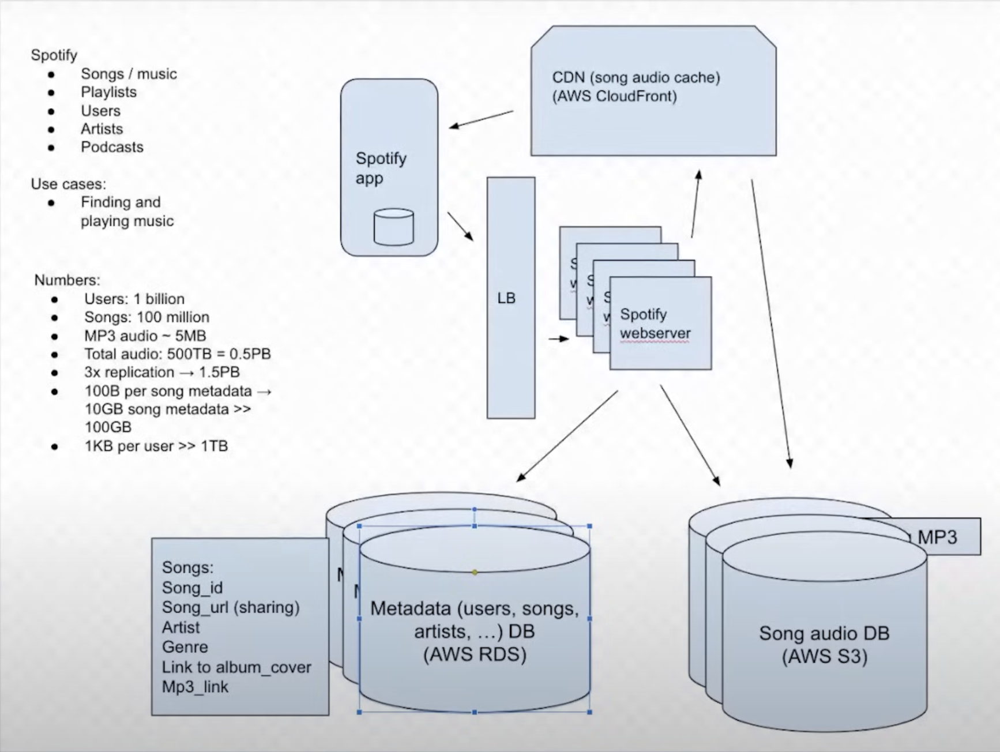

# SPOTIFY

## WHY DO WE NEED IT?
Play music

## REQUIREMENTS/GOALS

### Functional Requirements

- Search for song
- Browse through songs
- Play a song
- Create a playlist
- Play a playlist

### Non Funtional Requirements

- High avaialability
- Low consistency is ok
- Minimum latency for streaming and searching

## Estimations
- 1B DAU
- 100M songs
- MP3 audio -> 5MB (depends on song lenght, encoding, etc) 
- Total storage for songs = 100M * 5MB = 500 * 10**6 * 10**6 B = 500 * 10**12 = 500TB
- We have multiple copies (lets say 3x) -> 1.5PB storage
- For song metadata, we can assume 1KB per song -> 100B * 100M = 100GB metadata
- For user metadata, 1KB per user -> 1B * 1KB -> 1TB

