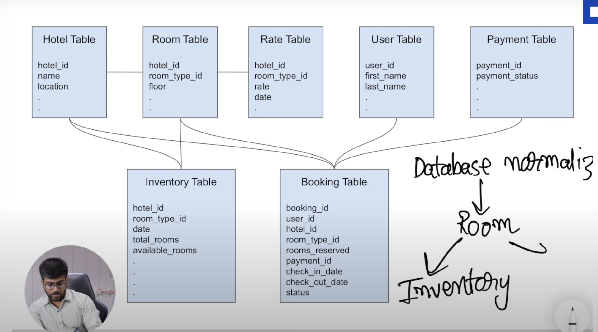
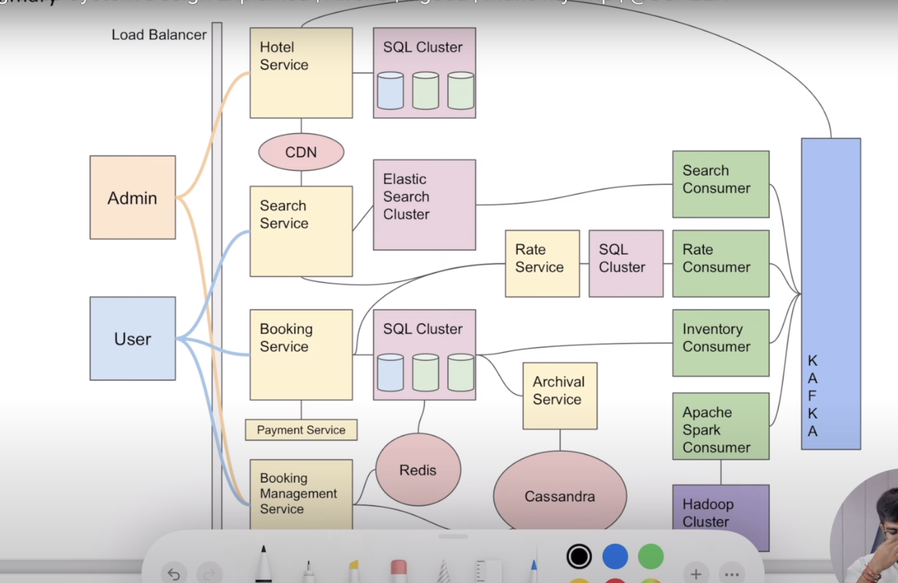

# MAKE MY TRIP

## FUNCTIONAL
- Search hotels
- Get hotel details
- Get room type details
- Create booking
- Check bookings

## NON FUNCTIONAL
- Low Latency
- High Availabilty (search)
- High consistency (booking)

## ESTIMATIONS

- 10K Hotels
- 100 rooms/hotels -> 1M rooms
- 80% occupancy rate, with 4night booking
    - 1M*80%/(4*86400sec) = 2TPS (2 bookings per second)
- Assuming 1% conversion, 200QPS

## APIs

- CRUD Hotels
- CRUD Rooms
- Booking APIs
- Seach API

## DB Choice
- Write QPS low, NoSql is not neccessary
- Interelted objects
- Need to follow ACID -> Choose SQL

- For seach, use elastic search and Kafka Queue to fill up ES cluster
- Use blob storage and CDN for images

## Design
- Book rooms
- Update status
- Use redis for expiry for payment statuses
- Store older bookings in cassandra through archiver
- For frustated users, use idempotent APIs
- For concurrency race conditions, use pessimitistic lockings as TPS is low

