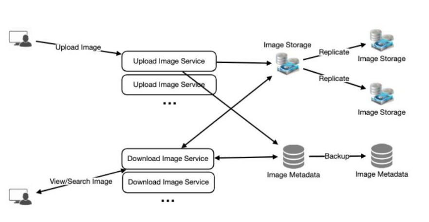

# Instagram

## 1. WHY DO WE NEED IT?

- Photo sharing service
- Users can follow others
- Have a news feed


## 2. REQUIREMENTS/GOALS

### Functional Requirements
- Users should be able to upload/download/view photos
- Users should be able to follow other users
- System should generate a news feed based on the users followed by a user
- Seach photos on the basis of title


### Non Functional Requirements
- High availability
- High reliability (uploaded photos shouldn't be lost)
- Consistency can take a hit 
- News feed acceptable latency ~ 200ms


### Not in scope
- Comments
- Tagging photos
- Search based on the tags


## 3. DESIGN CONSIDERATIONS
- Users can upload as much photos as they like, efficient storage management is needed
- System should be 100% reliable, uploaded photos shouldn't be lost
- There should be low latency while viewing a photo

## 4. CAPACITY ESTIMATIONS AND CONSTRAINTS
- Let's assume we have 500M users
- 1M daily active users
- 2M daily photo uploads
- Each photo is of 200KB size
- Daily storage requirement = `2M * 200KB ~= 400GB`
- Storage requirement for 10 years = `400GB * 365 * 10 = 1460TB`

## 5. HIGH LEVEL SYSTEM DESIGN

- Two main use-cases -> Upload a photo, view a photo
- Would need an object storage for photos
- DB server to store the metadata


## 6. DATABASE SCHEMA

- Store user info
- Store info about the users a user follow
- Store photo metadata and index on PhotoID, creation date, since we need to fetch recent photos first.

### TABLE PHOTO
- PHOTO_ID: INT
- USER_ID: INT
- PHOTOPATH: VARCHAR(256)
- PHOTO_LATITUDE: INT
- PHOTO_LONGITUDE: INT
- USER_LATITUDE: INT
- USER_LONGITUDE: INT
- CREATION_DATE: DATETIME

### TABLE USER
- USER_ID: INT
- NAME: VARCHAR(20)
- EMAIL: VARCHAR(32)
- DATE_OF_BIRTH: DATETIME
- CREATION_DATE: DATETIME
- LAST_LOGIN: DATETIME

### TABLE USERFOLLOW
- USER_ID_1: INT
- USER_ID_2: INT

### OBSERVATIONS
- We can use relational DB (MySQL) as we require joins
- Would be a challange to scale them though
- We would be using object storage to store the photos
- Instead of RDBMS, we can also go for key-value store to enjoy the benefits of NoSql
- We can store photo metadata in a table where photo_id would be the key and value would be an object containing all the details
- Same approach can be used to store user details
- For storing the photo-user and user-user relationships, we can use a wide-column NoSql database like Cassandra
- Table UserPhoto would have a key user_id and value would be list of photo_ids that the user owns in different columns
- Same scheme can be used for storing UserFollow relationship
- These stores always maintain replicas so reliability is sorted
- Also deletion isn't applied instantly to support undo

## 7. DATA SIZE ESTIMATIONS
- Let's estimate data for 10 years
- Let's consider int and datetime takes 4 bytes
- For user data, we would need **68 bytes** per row
```
USER_ID (4 bytes) + NAME (20 bytes) + EMAIL: (32 bytes) + DATE_OF_BIRTH (4 bytes) + CREATION_DATE (4 bytes) + LAST_LOGIN (4 bytes) = 68 bytes
```
- If we have 500M constant users, we would need : `500M * 68 bytes ~= 32GB`

- For photos data, we would need **284 bytes** per row
```
PHOTO_ID: (4 bytes) + USER_ID (4 bytes) + PHOTOPATH (256 bytes) + PHOTO_LATITUDE (4 bytes) + PHOTO_LONGITUDE (4 bytes) + USER_LATITUDE (4 bytes) + USER_LONGITUDE (4 bytes) + CREATION_DATE (4 bytes) = 284 bytes
```
- For 2M photos per day, we would need `2M * 284 ~= 0.5GB` per day
- For 10 years, we would need `0.5GB * 365 * 10 = 1.88TB`

- For user follow data, each row would have 8 bytes
```
USER_ID_1 (4 bytes) + USER_ID_2 (4 bytes) = 8 bytes
```

- Let's assume each user follows 500 users, we would need `1.82TB`

```
500M * 500 * 8 bytes ~= 1.82TB
```

- Total space required for all the tables for 10 years would be
```
1.82TB + 1.88TB + 32GB ~= 3.7TB
```

## 8. COMPONENT DESIGN

- Photo writes would be slow as we need to write disk
- Photo reads would be fast, especially if we use a cache
- Since a server can have only limited connections, let's assume 500 at any time, a user won't be able to read if uploading users consume all the connections
- To handle this, we can split our read and write into separate services
- This will also allow us to scale them individually

## 9. RELIABILITY AND REDUNDANCY

- We can't lose files thus we will have to store multiple copies of each file
- If one storage server dies, we can use another one
- We can apply this at other services as well by having multiple replicas
- We can have multiple instances of a service running so that if the primary one dies, secondary one take the control after the failover
- Creating redundancy removes single point of failure but is costly
- Failover can happen automatically or may require manual intervention



## 10. DATA SHARDING 

## 11. RANKING AND NEWS FEED GENERATION

## 12. NEWS FEED WITH SHARDED DATA

## 13. CACHE AND LOAD BALANCING