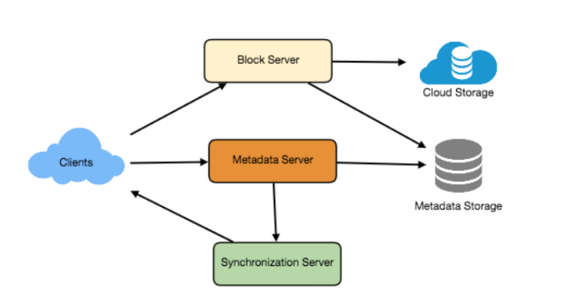
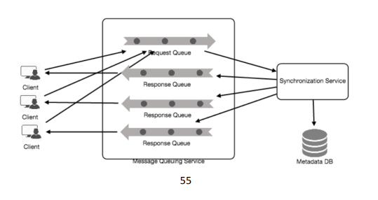
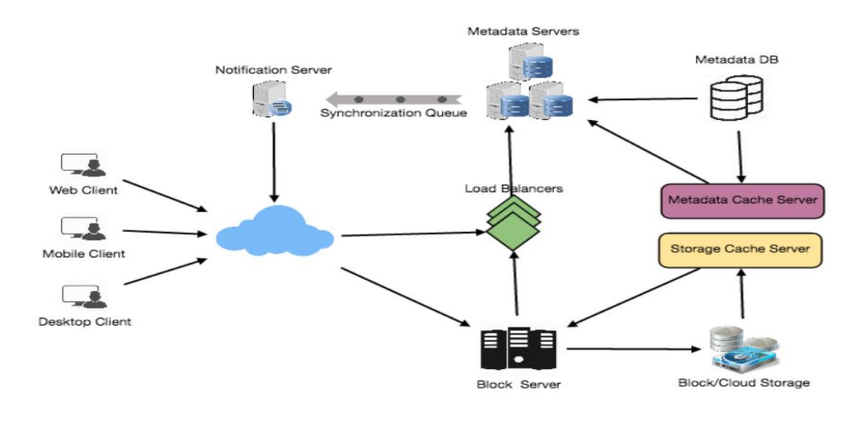

# Dropbox

## 1. WHY DO WE NEED IT?

- File hosting service, enables users to store data on remote servers
- Users pay a subscription fees
- Simplify file sharing between different users or different devices (mobile, laptop, tablets, etc)
- Top benefits of cloud storage
    - **Availability** - Data is available anytime from anywhere
    - **Reliability & Durability** - Cloud storage ensures that users do not lose their data by storing it in multiple geographically distributed servers
    - **Scalability** - Users do not have to worry about storage limitations as long as they are willing to pay for it

## 2. REQUIREMENTS AND GOAL OF THE SYSTEM

### Function Requirements
- Users should be able to upload/download files
- System should support sharing of files/folders between users
- System should support storage of large files
- System should support offline modifications of files or folders, when users come online these changes should be synced
- Changes should be synced across all the devices that user uses

### Non Functional Requirements
- ACID-ity is required (Atomicity, Consistency, Isolation, Durability) of all file oprations
- Availability, Reliability, Scalability

### Extended Requirements
- System can support snapshots of data so that user can go back to any version of the files

## 3. SOME DESIGN CONSIDERATIONS

- We should expect high read and write volumes
- Read-Write ratio will apporximately be same 
- We can divide our files into smaller chunks (say 4MB) while storing on our db
- So if an upload fails, only the failed chunks will be retried
- This will also reduce the amount of data exchange by transferring the updated chunks only
- For smaller changes, clients can create a diff at their end and send the updated chunks only
- Clients can also keep a local copy of metadata at their end to reduce round trips.

## 4. CAPACITY ESTIMATIONS AND CONSTRAINTS

- Let's assume we have 500M users
- 100M daily active users (DAU)
- Let's assume each user has 200 files, thus total files we need to store = `500M * 200 = 100B files`
- Let's also assume that each file on an average is of 100KB. Thus total storage needed = `100B * 100KB = 10PB`.
- Let's assume we have 1M active connections per minute.
- Summarizing we have the following data:

|                      |             |
| -------------------- | ----------- |
| Total Users          | 500 Million |
| Files per user       | 200         |
| Total files          | 100 Billion |
| File size (avg)      | 100 KB      |
| Total Storage        | 10 PB       |

## 5. HIGH LEVEL DESIGN

- The user will specify a folder as a workspace and any file file or folder placed in this folder will propogate onto the cloud, whenever user deletes or modifies it, the same will be reflected on cloud
- Similarly the user have its workspace on all its devices which will be synced across, any changes made on device 1 will also reflect on device 2.
- To faciliate this, at higher level we need to:
    - Store the files and folders
    - Store the metadata like name, size, directory and with whom the file/folder is shared with
    - We also need some mechanism which will tell all the devices when a change is made on one device
- For this, we need to have:
    - A block server which handle file uploads, downloads on cloud storage
    - A metadata server which handle the storage of metadata of files and folders in NoSQL or SQL db
    - A Synchronisation server which will handle the syncing of all the devices by notifying them about the change

## 6. COMPONENT DESIGN

### 6.1. Client

- Monitors the workspace folder and syncs the changes with the cloud
- Works with the storage service to handle the upload/download/modification of files on the cloud storage
- The client also talks with the sync and metadata service to update the metadata of files and folders
- Important ops of clients:
    - Upload/Download files
    - Detect changes in the workspace folder
    - Handle conflicts because of offline or concurrent changes

#### How do we handle file transfer efficiency?
- Divide our file in fixed sized chunks lets say 4MB, and only transfer the modified chunks when required
- To optimise space and I/O operations per second (IOPS) we can determine the optimal chunk size on the basis of:
    - Storage device we are using on the cloud
    - Average file size on our server
    - Available network bandwidth
- Metadata of files should contain the info about these chunks
- We can keep a local copy of metadata at client to enable offline updates and save a lot of round trips

#### How clients can listen to changes happening with other clients?
- One solution is to make periodical HTTP calls to the server expecting a result
- This approach will have a delay in displaying the changes
- We cannot make frequent calls because most of the times the server would return an empty reponse and it will also keep the server busy
- Workaround for these issues is to use an **HTTP long polling connection**
- The server will hold the connection and will send the response when it becomes available
- The client will then immediately send another request with expectation that the server will not respond immediately

#### We can divide our client into following parts:
- **Internal Metadata DB** - It will keep track of all the files, location, chunks, etc.
- **Chunker** - This will be responsible to break down a large file into chunks and transfer only the modified chunks by identifying them. We can also use this to reconstruct the file using the chunks
- **Watcher** - This will monitor the workspace and tell the Indexer about any changes that the user makers. This will also watch for any changes happening on other clients which are broadcasted by the sync service
- **Indexer** - This processes the events from the watcher and updates the metadata db with new information. Once chunks are successfully submitted to or downloaded from the cloud storage, indexer communicates with the sync service to broadcast the changes on all the devices and update remote metadata db

### 6.2. Metadata Database
- Responsible for maintaining the versioning and metadata info of file, chunks, users, workspace, etc.
- It can be a relational one or non-relational
- If we go with non relational DB, we will have to take care of ACID properties with the help of our sync service, since they do not support ACID properties in favour of performance and scalability
- We can also go with a relational DB since it supports ACID properties natively
- We need to store metadata info about different objects such as:
    - Users
    - Files
    - Chunks
    - Devices
    - Workspace

### 6.3. Synchronization Service
- Talks with client to get or send new data to cloud storage
- Syncs all the subscribed devices by sending them updates
- Updates client as soon as it comes online by polling
- Syncs local metadata db with the remote one
- Sync service should only transmit less data bw client and cloud storage using a diffing algo
- We can divide files into 4MB chunks and only transmit the changed ones
- Server and client can calculate a hash (eg SHA-256) to see whether to update the chunks or not
- If we have a chunk with the calculated hash, even if uploaded by a different user, we should not update it
- There should be messaging middlewear to facilitate high scale notifications

### 6.4 Messaging Queue Service
- We need a scalable msg queue service which can handle large number of request
- This service should be able to handle asynchronous msg based communication between the client and the sync service
- The msg queue service should be able to efficiently store any number of msgs in a available, reliable and scalable queue
- There will be two types of queues in this service
    - **Request queues** will be global and will be shared by all the clients
    - If a client wants to update something in metadata db, it will send the request to the queue, the queue will talk to the sync service asynchronously, then finally it is sent to the metadata db
    - **Response queues** will be responsible for delivering the updates to the subscribed clients
    - As the msg is deleted as soon as it is received, we will need separate response queues for all the clients

### 6.5 Cloud Storage
- This stores the chunks of the files uploaded by the clients
- Clients directly interact with the cloud storage to send/receive the data

## 7. FILE PROCESSING WORKFLOW
- This sequence shows the workflow when a **Client A** updates a file that is shared with **Client B** and **Client C**.
- Both B and C should receive the updates
- If the clients are not online, the msg queue service keeps notification in a seprate response queue for them until they come online
    - Client A uploads updated chunks to the cloud storage
    - Client A updates the metadata db and commits the changes
    - Client A receives a confirmation and Client B and C are sent notifications
    - Client B and C receive the notification and download the updated chunks

## 8. DATA DEDUPLICATION
- Technique to eliminate duplicate chunks of data to improve storage utilization
- Can also be applied at data transfers to save bandwidth
- We can calculate hash of the chunks and see if it is already stored in the storage
- There are two ways to implement this:
- **Post Process Deduplication**:
    - New chunks are stored as soon as uploaded by the client
    - A seprate service later on checks if a chunk with similar hash is already present
    - If it is there, the new chunk is deleted
    - Pros: Client don't need to wait for hash calculation thus increasing the performance
    - Cons: Unnecessary storing duplicate chunks, wastage of network bandwidth

- **In Process Deduplication**:
    - Hash calculations can be done in real time as soon as clients are entering new/updated data
    - If our system identifies a duplicate chunk hash, only a reference to the existing chunk is added by to the metadata, this gives us optimal bandwidth usage

## 9. METADATA PARTITIONING
- We need to partition our metadata db to store info about the 100B files
- **Vertical Partitioning**:
    - Partition in a way such that we stores table related to a specific object in one server.
    - User related tables in one server, chunks details in another server and so on.
    - Issue is, there will be unbalanced server
    - Some db, for example chunks related db might have a lot of data, lets say trillion of rows, which our db might not support. How will we scale then?
    - Joining 2 tables from separate db might cause performance lag
- **Range Based Partitioning**:
    - We can define a range for example, based on the first character of the file path
    - Files with path starting with character A will be in one server, B will be in another and so on
    - This will cause unbalanced servers as well if one path is common
- **Hash Based Partitioning**:
    - In this, we take hash of the object we want to store using our hashing function and we store the object on the basis of that hash
    - In our case we can take hash of FileID
    - Our hashing function will randomly distribute objects in different partition
    - Hashing function can map an ID to a specific number [1...256] and this number would be the partition number we would use
    - This can still cause unbalanced server for which we can use consistent hashing

# 10. CACHING
- We can use cache at block storage to deal with hot chunks files
- Can use memcached to store chunks with its respective ID
- We can find the cache required based on the usage pattern
- One high end cache can have 144GB of memory which can store ~36K chunks
- We can use LRU for cache eviction
- Similarly we can have a cache for metadata

# 11. LOAD BALANCER
- We can LB between:
    - Client and block storage
    - Client and metadata servers
- Can use round robin approach initially
- As it doesn't take server load into consideration we can later on use another approach like weighted round robin based on the usage pattern

# 12. SECURITY, PERMISSION AND FILE SHARING
- Privacy is a major concern in our use case
- We need to store which file is public, which file is private, and which file is shared between a specific group of people
- To handle this, we will be storing permission info of each file in our metadata DB to reflect which which files are visible and modifiable by any user.