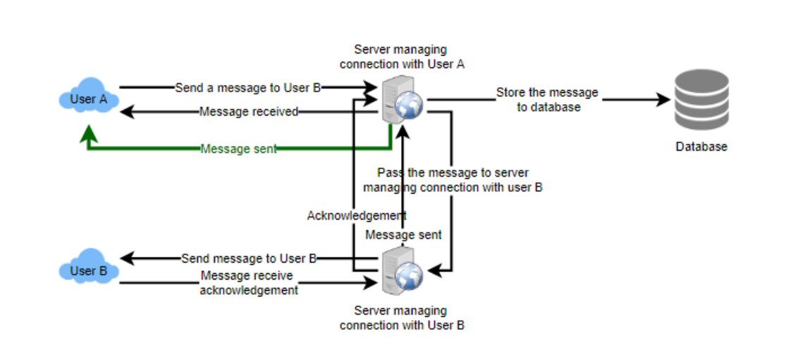

# Facebook Messenger

## 1. WHY DO WE NEED IT?
- Provides instant messaging service
- Users can use both thier phone or desktop

## 2. REQUIREMENTS AND GOALS OF THE SYSTEM

### Functional Requirement
- 1-1 conversations
- Online/Offline status of the users
- Persistantly store chat history

### Non Functional Requirement
- Real time experience with low latency
- High consistency, same chat history should be in all the devices
- Can trade high availability for consistency although it is desirable

### Extended Requirement
- Group Chats
- Push notifications for offline users

## 3. CAPACITY ESTIMATIONS AND CONSTRAINTS
- Assume we have 500M daily active users
- Each user sends 40 msg a day
- `500M * 40 = 20B` msgs per day

### Storage Estimations
- Assume on average each msg is of 100 bytes
- `100bytes * 20B = 2TB/day` storage requirements
- Let's say we need to handle 5 years of storage then storage req = `2TB * 365 days * 5 ~= 3.6PB`
- Aside from this, we would also need to store metadata of the msgs, users, etc
- We also need to consider data replication

### Bandwidth Estimation
- We need to handle 2TB of data every day, this gives us
- `2TB/(24 * 60 * 60) = 25MB/sec`
- We need this for both upload and download

### High Level Estimation

|                      |                    |
| -------------------- | ------------------ |
| Total Messages       | 20 billion per day |
| Storage for 1 day    | 2TB                |
| Storage for 5 years  | 3.6PB              |
| Incoming Data        | 25MB/sec           |
| Outgoing Data        | 25MB/sec           |

## 4. HIGH LEVEL DESIGN

- We need a chat server which will handle to and fro of the msgs
- The workflow would be like:

- User A sends a msg to User B through chat server
- Chat server receives it and sends the ack to User A that the msg is sent
- Chat server will store the msg in the DB and will send it to User B
- User B would send an ack to the chat server upon receiving the msg
- The chat server would then notify User A about the delivery of the msg

## 5. DETAILED COMPONENT DESIGN
- We need a server which would handle the following:
    - Deliver outgoing msgs, Receive incoming msgs
    - Store and retrieve msgs from DB
    - keep track of offline/online status of users

### 5.1 Messages Handling
- The user would connect to server to send the msg
- The server has two ways to deliver the msg
    - clients can periodically **pull** new msgs from the server
    - or, the server can **push** the msg as soon as it comes through an open connection

- PULL method:
    - Server would need to keep a track of all the msgs that still needs to be delivered
    - There would be latency in msgs delivery if clients ask for msgs periodically
    - If we make calls frequently, it would decrease the latency but there will be a lot of empty responses, wasting resources

- PUSH method:
    - We will have an active connection
    - Low latency as the msgs will be pushed to clients as soon as it is sent
    - No need to keep a track of undelivered msgs
    - Can do this by long-polling or websockets
    - We would have a hash table with key as user_id and value as connection object, when a msg needs to be transfered to a user, we will find the connection through this table

- If server receives a msg and the user is offline, it can notify the server about failed delivery, then the client can retry. We can implement retries at server level too

- If we `500M` active users at any time, if a server can hold `50K` concurrent connections, we would need `10K` servers

- Following steps takes place in delivery:
    - The user sends a request to send a msg
    - There will load balancers in front of chat servers
    - Load balancer will pass the request to the user mapped chat server
    - This chat server will find the server maintaining the connection with the receipent user
    - Chat server will pass the request to that server, storing the msg in the db in the background

- There will be senarios when msg sequence for two users would be different in their chat
- Keep a sequence number with every msg for each client
- This will keep ensure that atleast the ordering is same for all his/her devices

### 5.2 Storing and Retrieving the messages from DB
- We have two options:
    - Create a seprate thread and work with DB
    - Send an async call to the DB
- Things to keep in mind:
    - Efficiently work with the DB connection pool
    - How to handle retiries
    - How to handle logging of msgs which fail even after certain retires
    - How to retry logged msgs once the errors are fixed
- Since we need to store a small amount of data very frequently and fetch range of records quickly
    - Working with MySQL is inefficient
    - Wide column DB (Like HBase) solves both problem
    - HBase is a key val no sql db, modeled after BigTable
    - Stores multiple columns against a key
    - Groups new data together in a memory buffer and dumps in the disk when memory fills up
    - Can be used to fetch rows by keys and get range of data
    

### 5.3 Managing user status
